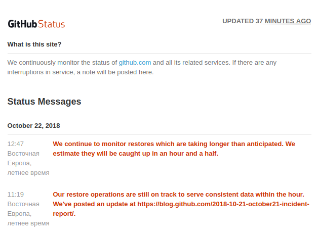
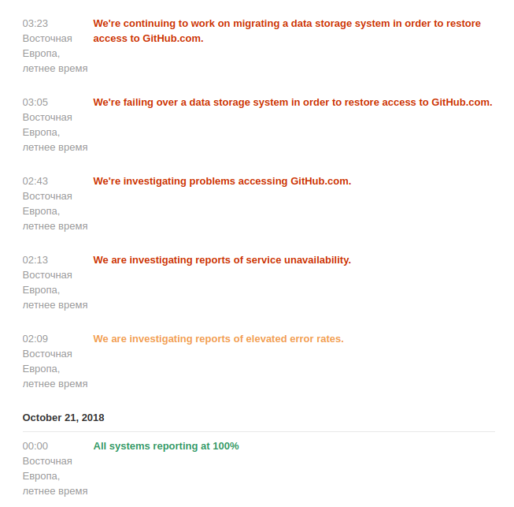
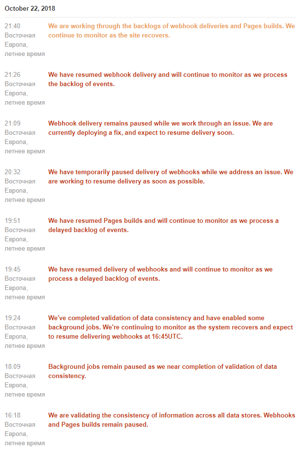

# monitoring-dz05
Домашнее задание к занятию 17 «Инцидент-менеджмент»

Добрый день,  на производстве фиксирован инцидент, влияние на прод - минимальное.

Приблизительно выбираем следующий алгоритм

1.  **О зрелости мониторинга (Слайд 16):** В документе сказано, что «в идеале инцидент обнаруживается мониторингом». Как **DevOps-лидер**, я обязан спросить: описанная ситуация с ночным алертом на CPU (Слайд 31) — это срабатывание **симптома** (пользователям плохо) или **причины** (CPU высокая)? Нас интересует, насколько текущий мониторинг ориентирован на SRE-подход (Service Level Objectives), или мы всё ещё реагируем на сырые метрики инфраструктуры?

SRE 

2.  **О ролях (Слайды 21-23):** Роль «Управляющего инцидентом» (IC) и «Технического руководителя» (TL) разделены, что правильно. Однако в условиях ограниченной команды DevOps/SRE часто это одно и то же лицо. Вопрос: **При каком уровне критичности инцидента в вашей компании роли IC и TL принудительно разводятся по разным людям, чтобы избежать «туннельного зрения» при диагностике?**

Регистрация и сбор производятся дежурной сменой, далее передается в ops  или devops или dba или network к ответственным по направлениям.

3.  **О «Серых инцидентах» (Слайд 10):** Тезис «Не должно быть серых инцидентов» звучит утопично для сложных распределенных систем. Как инженер автоматизации, я знаю, что микросервисы часто деградируют частично. Вопрос: **Каков ваш порог входа в процесс инцидент-менеджмента?** Если у нас ошибка 500 на одном шарде, затрагивающая 0.5% трафика, мы открываем статус-пейдж с красным баннером «Service Disruption» или ограничиваемся тикетом?

открываем статус-пейдж, и привлекаем, будим инженеров dev + ops и secops и начинаем будить и чинить.

4.  **О Постмортеме (Слайд 30-31):** Пример постмортема очень линейный («баг -> патч -> фикс»). Blameless культура упомянута отлично. Вопрос по анализу: В таймлайне **02:05 был коммит, 02:09 выкатка**. Как эксперт по безопасности и надежности я спрошу: **Где в этом таймлайне этап тестирования?** Мы осознанно его пропустили ради скорости восстановления (что нормально для критичного сбоя) или в CI/CD пайплайне просто нет автоматических тестов, блокирующих выкатку в прод?

пропустили для скорости восстановления, скорректируем далее после устранения основного инцидента

5.  **О Коммуникации (Слайд 11):** Перечислены каналы: Email, Chat, SMS, Status Page. Вопрос как к лидеру: **На ком лежит ответственность за обновление Status Page во время инцидента?** (По ролям — это Менеджер по коммуникациям). Но **кто пишет текст и кто нажимает кнопку «Опубликовать»?** Часто в реальности это делает сам дежурный инженер, теряя фокус с технической проблемы.

Печально, но это технический инженер или его руководитель.

Переходим к "Разбору полетов"
На GitHub произошёл сбой БД
1 мин
12K
Git
*
GitHub
*
Сегодня после нескольких попыток создания Issue и записи комментариев к уже существующим — столкнулся с тем что запись/комментарий визуально отображаются а после перезагрузки — пропадают.

Как оказалось всему виной ночной сбой на серверах GitHub:

В 22:52 (21.10) по UTC на нескольких сервисах GitHub.com пострадали несколько сетевых разделов и последующим сбоем базы данных, что привело к появлению непоследовательной информации на нашем веб-сайте. В качестве предосторожности мы предприняли шаги для обеспечения целостности ваших данных, включая приостановку работы событий (hooks) и других внутренних систем обработки.

Мы знаем, насколько важны наши услуги для ваших рабочих процессов разработки и активно работаем над созданием расчетного таймфрейма до полного восстановления. Мы поделимся этой информацией с вами, как только она будет доступна. В течение этого времени информация, отображаемая на GitHub.com, скорее всего, будет устаревшей; однако данные не были потеряны. Как только сервис будет полностью восстановлен, все должно выглядеть так как и ожидалось. Кроме того, этот инцидент повлиял только на метаданные веб-сайтов, хранящиеся в наших базах данных MySQL, такие как Issue и PR. Данные репозитория Git остаются неизменными и доступны на протяжении всего инцидента.

Мы продолжим обновлять данные и приблизительное время до разрешения проблемы через нашу страницу статуса: status.github.com/messages

Напомню что в прошлом году подобный сбой БД (правда с другими причинами и последствиями) был у сервиса GitLab.

P.S. На 22:00 (22.10) по Киеву — работа всё-ещё не восстановлено полноценно.

............П О С Т М О Р Т Е М............

 Как DevOps-лидер и эксперт, я проанализировал предоставленный «разбор полётов», комментарии пользователей и, что критически важно, официальный детальный постмортем GitHub от 30 октября 2018 года (текст которого вы приложили в файле после комментариев).

Основываясь на структуре документа «Инцидент-менеджмент» (Слайд 29) и принципах Blameless-культуры, я составил **профессиональный постмортем**, который можно использовать как эталон для внутреннего обучения команды.

***

### Постмортем инцидента GitHub от 21-22 октября 2018 года

**Дата инцидента:** 21 октября 2018, 22:52 UTC — 22 октября 2018, 23:03 UTC
**Продолжительность деградации:** 24 часа 11 минут
**Автор постмортема:** SRE/DevOps Lead (анализ на основе публичных данных GitHub)

#### 1. Краткое описание инцидента (Executive Summary)
В результате плановых работ по замене оптического оборудования произошла кратковременная (43 секунды) потеря сетевой связности между сетевым хабом Восточного побережья США и основным ЦОДом. Это вызвало срабатывание алгоритмов RAFT в системе управления кластерами БД (Orchestrator). В результате был инициирован аварийный перевод нагрузки (failover) MySQL-кластеров на Западное побережье США.

Приложения GitHub оказались не готовы к работе с кросс-региональной задержкой в 60+ мс, что привело к деградации сервиса на 24+ часа. **Потери пользовательских данных (Git-репозиториев) не произошло.** Часть метаданных (issues, PR, webhooks) временно отображалась некорректно из-за отставания репликации.

#### 2. Предшествующие события (Trigger)
*   **22:52 UTC:** Проведение рутинного технического обслуживания для замены выходящего из строя оптического трансивера 100G.
*   **Результат:** Разрыв сетевого соединения (network partition) на 43 секунды между хабом и ЦОДом Восточного побережья.

#### 3. Корневая причина (Root Cause)
**Техническая причина:** Сбой сети вызвал незапланированную миграцию лидера RAFT в `Orchestrator`.
**Системная причина:** Несоответствие конфигурации автоматического восстановления (`Orchestrator`) и архитектурных ограничений приложений (`GitHub App Tier`).
*   **Orchestrator** отработал штатно согласно настройкам: он перенес мастера БД туда, где смог собрать кворум (Западное побережье).
*   **Приложения** были спроектированы для работы с низкой задержкой (<1 мс) в пределах одного ЦОДа и **не поддерживали** транзакционную нагрузку при задержке кросс-континентальной сети (~60-80 мс).

#### 4. Воздействие на пользователей и бизнес (Impact)
*   **Web-интерфейс:** Невозможность создания/обновления Issues, Pull Requests, комментариев. Частичная потеря консистентности данных из-за чтения с отстающих реплик. (Пользователи жаловались: *«создал issue — пропало, создал gist — появилось 3 штуки»*).
*   **Сервисы:** Полная остановка обработки **Webhooks** (накоплена очередь в ~5 млн событий) и сборки **GitHub Pages** (~80 тыс. задач в очереди).
*   **Git-операции:** `git push` / `git pull` работали **без перебоев**, так как Git-бэкенд не зависит от затронутых MySQL-кластеров.
*   **Доверие:** Серьезный репутационный урон из-за длительности восстановления (почти сутки).

#### 5. Обнаружение и Реакция (Detection & Response)

| Время (UTC) | Событие | Роль (согласно слайдам) |
| :--- | :--- | :--- |
| **22:52** | Сетевая пауза 43с. Orchestrator начинает миграцию мастера на US West. | **Автоматика / Мониторинг** |
| **22:54** | Шквал алертов. Дежурная смена начинает разбор. | **Дежурный инженер** |
| **23:07** | Принято решение о блокировке деплоев (lock internal tooling). | **Тех. руководитель (TL)** |
| **23:11** | Статус страницы переведен в **RED**. Эскалация на команду БД. | **Управляющий инцидентом (IC)** |
| **23:19** | **Ключевое решение**: Приоритет целостности данных над доступностью. Принято решение отключить Webhooks и Pages, чтобы остановить запись неконсистентных данных в отстающие БД. | **IC + TL + DBA** |
| **00:05 (22 окт)** | Старт восстановления из бэкапов для синхронизации Восточного ЦОДа. | **Инженеры БД** |

#### 6. Восстановление (Recovery)
**Стратегия:** Fail Forward (работаем через Запад) -> Синхронизация (Восстановление Востока из бэкапов) -> Fallback (Возврат мастера на Восток).
*   **Проблема 1: Скорость бэкапа.** Загрузка multi-TB данных из облачного хранилища заняла часы.
*   **Проблема 2: Replication Lag.** Из-за пиковой утренней нагрузки в Европе и США репликация не успевала догонять мастер, из-за чего пользователи видели «старые» данные (Status Yellow с оговорками).
*   **Решение:** Масштабирование пула Read-реплик в облаке (US East Cloud) для распределения нагрузки чтения и ускорения синхронизации.
*   **23:03 (22 окт):** Все системы восстановлены. Очереди обработаны. Статус **GREEN**.

#### 7. Таймлайн ключевых решений (Timeline Highlights)

*   **22:52** — Кратковременный сбой оптики.
*   **23:02** — Обнаружена аномалия топологии БД (мастер на Западе).
*   **23:19** — **Heroic Decision**: Отключение Webhooks ради сохранности данных.
*   **06:51 (22 окт)** — Первые кластеры БД синхронизированы, но работают с задержкой. Начало активной фазы ожидания/лечения.
*   **13:15 (22 окт)** — Осознание, что Replication Lag не падает линейно из-за роста трафика.
*   **16:24 (22 окт)** — Успешный Failback мастера обратно на Восточное побережье.
*   **23:03 (22 окт)** — Завершение обработки очереди хуков.

#### 8. Последующие действия (Action Items)

| № | Задача | Ответственный | Приоритет | Связь со слайдами |
| :--- | :--- | :--- | :--- | :--- |
| **1** | **Изменение конфигурации Orchestrator.** Запрет на автоматический перевод мастера между регионами (Cross-Region Failover). | DBA / SRE | **Critical** | *Слайд 5 (эскалация по знаниям)* |
| **2** | **Добавление Chaos Engineering тестов.** Регулярная симуляция network partition + cross-region latency для валидации поведения приложений. | SRE / Dev | **High** | *Слайд 30 (предотвращение)* |
| **3** | **Улучшение механизма Status Page.** Переход от "RED/YELLOW/GREEN" к компонентному отображению статуса (Git, Issues, Actions отдельно). | Менеджер по коммун. | **Medium** | *Слайд 11 (каналы)* |
| **4** | **Аудит таймаутов БД в приложениях.** Проверка устойчивости к latency 50-100ms. | Tech Lead | **High** | *Слайд 24 (исследование)* |
| **5** | **Ускорение процедуры восстановления из бэкапа.** Оптимизация restore-процедур для мульти-TB кластеров (возможно, локальное кэширование снепшотов). | DBA | **High** | *Вне документа* |

#### 9. Blameless-вывод (Уроки)

1.  **Конфигурация != Архитектура.** Система оркестрации (`Orchestrator`) была права с точки зрения своей логики. Ошибка была в несоответствии **возможностей автоматики** и **ограничений бизнес-логики приложений**. Это классический пример сбоя комплексной системы.
2.  **Ценность данных.** Решение пожертвовать временем восстановления (сутки) ради гарантии целостности данных пользователей — **правильное стратегическое решение**, несмотря на репутационные потери.
3.  **Разделение ответственности.** Команда действовала четко: дежурный нашел, управляющий принял решение о статусе RED, DBA начали восстановление. 

..........................О б о с н о в а н и е Э С К А Л А Ц И И...........................
 
 Привожу её в строгое соответствие с терминологией и структурой изученного документа **«Инцидент-менеджмент»**.

Вот как этот этап выглядит, спроецированный на **Слайд 19 «Эскалация на ответственных лиц»** и **Слайды 20-23 «Распределение ролей»**.

### Анализ эскалации в GitHub согласно документу

На основе предоставленного таймлайна GitHub, процесс эскалации прошел **штатно** по следующей цепочке, описанной в слайдах:

| Шаг по слайду | Действие согласно документу | Фактическое событие в кейсе GitHub |
| :--- | :--- | :--- |
| **1. Определение** (Слайд 16) | Инцидент обнаружен мониторингом или пользователями. | Обнаружен шквалом алертов системы мониторинга. |
| **2. Каналы коммуникации** (Слайд 17) | Использование единого инфополя (Slack/Thread) и голосовой связи. | Создан штаб в корпоративном мессенджере/конференции. |
| **3. Оценка критичности** (Слайд 18) | Присвоение уровня критичности. | В 23:11 статус изменен на **RED** (Super Critical). |
| **4. Эскалация** (Слайд 19) | Привлечение смежных команд (Ops, Security, DBA) по заранее известным каналам. | В 23:13 подняты по тревоге инженеры **Database Engineering Team**. |
| **5. Распределение ролей** (Слайды 20-23) | Назначение Управляющего (IC), Тех. руководителя (TL), Менеджера по коммуникациям. | **IC** принял решение о статусе RED и координировал восстановление. **TL/DBA** исследовали топологию БД и строили план отката. **Менеджер по комм.** (с задержкой, что признали ошибкой) обновлял status page. |

### Что значит «Не было хаоса в эскалации» в терминах слайдов?

Фраза означает, что в процессе GitHub были соблюдены **два ключевых принципа DevOps-эскалации**, описанных в предоставленном PDF:

1.  **Отсутствие «серой зоны» в ответственности (Слайд 19):**
    > *«Заранее определять круг лиц... и каналы коммуникации с ними. Если нет ответа от назначенного лица смежной команды, не должно быть неопределённости в том, кто его замещает».*
    **Факт:** Когда дежурный инженер (First Responder) понял, что проблема в топологии БД, он не пытался править конфиги MySQL сам. Он точно знал, что согласно процессу нужно **эскалировать инцидент на Database Engineering Team**. Не было потери времени на поиск «кто сегодня дежурит по базам».

2.  **Эскалация по компетенциям, а не по должностям (Слайд 5):**
    > *«Для DevOps-команд этот процесс... отличается эскалацией инцидентов в соответствии с профессиональными знаниями, а не занимаемыми должностями».*
    **Факт:** К решению подключили не «Старшего вице-президента», а конкретного инженера, который знает устройство `Orchestrator` и внутренности `MySQL GTID`. Управляющий инцидентом (IC) взял на себя **коммуникацию и координацию**, а Технический руководитель (TL) — **исследование причины**.

### Резюме по документу

В кейсе GitHub **эскалация была успешной**, потому что команда следовала правилу из **Слайда 19**:
> *«Не должно быть неопределённости в том, кто реагирует».*

Как только инцидент был классифицирован как `Super Critical` (RED), сработала четкая цепочка: **Дежурный -> Управляющий инцидентом -> Профильный эксперт (DBA)**. Именно это в документе названо зрелым процессом реакции.

